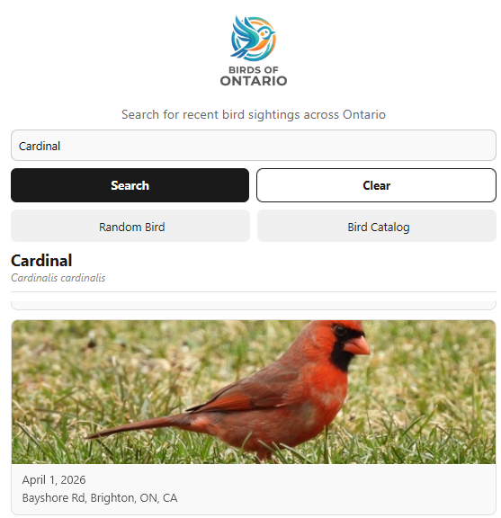

# Birds of Ontario

A React Native mobile app that displays real bird sightings across Ontario using the iNaturalist API.

## Features

- Search birds by name
- Random bird discovery button
- Bird Catalog showing the 50 most common species in a grid layout
- Real-time data from the iNaturalist API

## Technologies

- React Native
- Expo
- iNaturalist REST API
- FlatList for efficient list rendering
- Component-based UI architecture

## Key Concepts

- State management with useState
- API data fetching with fetch()
- Props-based component design
- Conditional rendering
